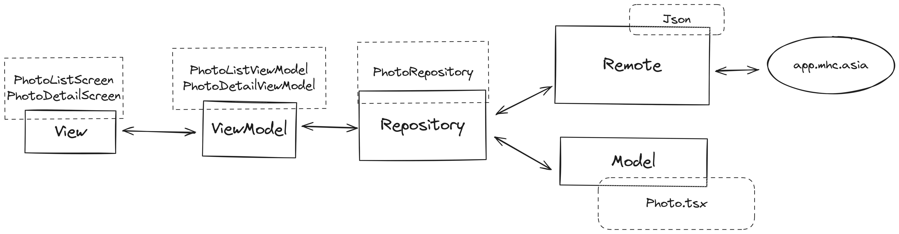

# MHC Asia Android Technical Test

# Context
This project is an Android technical test undertaken using the Typescript and React Native framework. React Native was chosen as discussed during the interview, and the MHC Asia app was developed using React Native. 
It has been quite some time since I last worked with React Native, so it's essential to note that the implementation is not production-ready.


Regrettably, due to time constraints, I was unable to incorporate any unit tests for this technical assessment.

# Architecture
The project follows the Model View ViewModel architecture, with repository pattern. 


# Project Structure
_io.limkhashing.mhcasia_
```markdown
├───src
│   ├───componenets
│   │   ├───*Item.tsx
│   │   └───"Other components"
│   ├───data
│   │   └───repository
│   │       └───*Repository.tsx
│   ├───di
│   │   └───ioc.tsx
│   ├───domain
│   │   └───model
│   │       └───*Model.tsx
│   ├───helper
│   │   ├───*Constants.tsx
│   │   └───*Helper.tsx
│   ├───navigation
│   │   └───*Navigation.tsx
│   │───presentation
│   │   └───sub-feature(s)
│   │       └───*Screen.tsx
│   │       └───*ViewModel.tsx
```

# Functional Requirements
1. **Retrieve JSON Data:**
   - The app should be able to fetch JSON data from the given URL (https://app.mhc.asia/test/photos.json).

2. **Display Data in List View:**
   - Display the fetched data in a list view.
   - Each row in the list view should include:
     - Thumbnail of the image.
     - ID displayed as name.
     - Category displayed as description below the name.

3. **Search Functionality:**
   - Implement a search bar to allow users to search images by name.

4. **Filtering Functionality:**
   - Include a filter button to filter the list view by odd or even numbers.

5. **Detail View:**
   - Upon tapping on a row in the list view, the system should load the full image on the next screen (detail view).
   - The detail view should fetch and display the full image using its URL.

6. **Image Zooming:**
   - Enable zoom functionality for the displayed image in the detail view, with pinch-to-zoom feature

7. **Bookmarking Functionality (List View):**
   - Include a bookmark button for each row in the list view.
   - Users should be able to toggle the bookmark button to indicate whether the row is being bookmarked.

8. **Bookmarking Functionality (Detail View):**
   - In the detail view, include a bookmark button for the displayed image.
   - Users should be able to toggle the bookmark button to indicate whether the image is being bookmarked.

# Running the React Native App
1. **Install Dependencies:**
   - Run the following command to install project dependencies first:
     ```
     npm install
     ```

5. **Run the App:**
   - Connect your mobile device or start an emulator. As of now, only Android is supported for this project
   - Execute the following command to start the React Native app:
     ```
     react-native run-android
     ```
     or
     ```
     npm run start
     ```
   - This will build the app and deploy it to your connected Android device or emulator.
